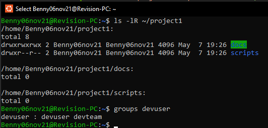

# DevOps-Linux
<br />

<details>
<summary>Week 1 Tasks – Intro to DevOps & Linux</summary>
<br />

## 1. Basic Linux Commands

```bash
# Basic commands to Navigate and manage directories

pwd                   # Print current directory
ls                    # List contents of the directory
mkdir devops_test     # Create new directory
cd devops_test        # Change to that directory
touch testfile.txt    # Create a test file
rm testfile.txt       # Delete the test file
cd ..                 # Go back one directory (can also do cd ../../ and etc)
rm -r devops_test     # Delete the directory
```

## 2. Create Users and Assign to Custom Group

```bash
# Create a new group
sudo groupadd devopsteam

# Create users and assign them to the group
sudo useradd -m -G devopsteam user1
sudo useradd -m -G devopsteam user2

# Verify group membership
groups user1
groups user2
```

## 3. Change File and Directory Permissions

```bash
# Create a directory and a file
mkdir /tmp/secure_folder
touch /tmp/secure_folder/groupfile.txt

# Change ownership to a user and group
sudo chown user1:devopsteam /tmp/secure_folder/groupfile.txt

# Change permissions to allow group read/write
sudo chmod 660 /tmp/secure_folder/groupfile.txt

# Verify permissions
ls -l /tmp/secure_folder/groupfile.txt
```

</details>

******

<details>
<summary>Week 1 Summary Task – DevOps & Linux Basics</summary>
<br />

## Part 1: Creating Directory Structure & Permissions

```bash
# Create base project directory in user's home directory
mkdir -p ~/project1/docs ~/project1/scripts

# Set permissions
chmod 744 ~/project1/scripts  # Owner: rwx, Group/Others: r--
chmod 777 ~/project1/docs     # Everyone: rwx (write access for all users)
```

## Part 2: User & Group Management

```bash
# Create user and group
sudo groupadd devteam
sudo useradd -m -G devteam devuser

# Set 'project1' ownership to your user and give group read-only access
sudo chown $USER:devteam ~/project1
chmod 740 ~/project1  # Owner: rwx, Group: r--, Others: ---
```

## Part 3: Verification Commands

```bash
# Show final directory structure and permissions
ls -lR ~/project1

# Show group membership for devuser
groups devuser
```
Screenshot of the outcome:  

## Command Explanations

- `mkdir -p`: Creates directories; `-p` ensures parent directories are made as needed.
- `chmod 744`: Sets file/directory permissions (`7`=rwx, `4`=r--).
- `chmod 777`: Gives full read/write/execute permissions to all.
- `groupadd`: Adds a new group to the system.
- `useradd -m -G`: Creates a user with a home directory and adds them to a group.
- `chown`: Changes ownership of a file or directory.
- `ls -lR`: Recursively lists directory contents with permissions.
- `groups`: Shows all groups a user belongs to.

> When we use `$USER` it becomes the current username (in my case Benny06nov21).

> We can use 'whoami' to confirm the current username:

</details>

******

<details>
<summary>Week 2 Tasks – Daily Practice Tasks</summary>
<br />

## Task 1: Hello DevOps Script

### Create the Script file `hello_devops.sh`

```bash
nano hello_devops.sh
```

### now we are in the file with nano editor, we can write the script:
```bash
#!/bin/bash
echo "Hello DevOps"
```
* to save press CTRL+O and then press enter.
* then to exit the nano press CTRL+X
* `#!/bin/bash`: Tells the system to use the Bash shell to run this script.

### Make Executable and Run:
```bash
chmod +x hello_devops.sh
./hello_devops.sh
```

---

## Task 2: File & Directory Checker

### Create the Script file same way as in first task: `check_file.sh`
```bash
#!/bin/bash

if [ -z "$1" ]; then
  echo "Usage: ./check_file.sh <filename>"
  exit 1
fi

if [ -f "$1" ]; then
  echo "$1 is a file."
elif [ -d "$1" ]; then
  echo "$1 is a directory."
else
  echo "$1 does not exist."
fi
```
- `$1`: is the first argument passed to the script.
- `-z`: checks if it's an empty string.
- `-f`: checks if a file exists and is a regular file.
- `-d`: checks if the path is a directory.

### Make Executable and Run:
```bash
chmod +x check_file.sh
./check_file.sh hello_devops.sh
```

---

## Task 3: List Files with Sizes

### Create the Script file same way as previous tasks: `list_files.sh`
```bash
#!/bin/bash

printf "%-30s %-10s\n" "Filename" "Size (KB)"
printf "%-30s %-10s\n" "--------" "----------"

for file in *; do
  if [ -f "$file" ]; then
    size=$(du -k "$file" | cut -f1)
    printf "%-30s %-10s\n" "$file" "$size"
  fi
done
```
- `printf "%-30s %-10s\n"`: Prints a formatted line with two columns:
    - %-30s → left-align string to 30 characters (for filename)
    - %-10s → left-align string to 10 characters (for file size)
    - The first two printf lines print the header and underline for the table.
- for file in *: Loops over all items in the current directory (files and folders).
- if [ -f "$file" ]; then: Checks if the item is a regular file (ignores folders).
    - du -k "$file":
    - du = disk usage
- -k = show size in kilobytes (KB)
- `cut -f1`: Cuts the first column of the du output (the size number).
- `size=$(...)`: Stores the file size into a variable called size.
- `printf ... "$file" "$size"`: Prints a row of the table with the filename and its size.

### Make Executable and Run:
```bash
chmod +x list_files.sh
./list_files.sh
```

---

## Task 4: Search for ERROR Logs

### Create a file for testing the script: `access.log`
```bash
cat > access.log << EOF
this is the first line
this is 2nd line with ERROR 
this is ERROR line 
this line has ERROR also
this ERROR line has two ERROR
EOF
```
- total ERROR count is 5, but there 4 lines with ERROR, i will demonstrate the difference below.

### Create the Script file with nano: `find_errors.sh`
```bash
#!/bin/bash

echo "Lines with ERROR:"
grep "ERROR" access.log

echo "Wrong ERROR count:"
grep -c "ERROR" access.log

echo "Correct ERROR count:"
grep -o "ERROR" access.log | wc -l
```
- if using `grep -c "ERROR" access.log` it will return '4' which is incorrect because `-c` Counts matching lines.
- if using `grep -o "ERROR" access.log | wc -l` it will return '5' which is the correct answer because:
    - `-o`: Only print matching parts
    - and then we pipe the result and use `wc -l` to count total matches

### Make Executable and Run::
```bash
chmod +x find_errors.sh
./find_errors.sh
```

---

## Task 5: AWK Column Extractor

### Create a file for testing the one-liner: `data.csv`
```bash
cat > data.csv << EOF
1,Benny,Developer
2,Shalom,Backend
3,Benjamin,DevOps
4,Bennyaaa,Linux
5,BennySh,SoftwareEngineer
EOF
```

### One-liner AWK for `data.csv`:
```bash
awk -F',' '{ print $2 }' data.csv
```

- `awk`: A text-processing tool.
- `-F','`: sets comma as the Separator (instead of the default: spaces).
- `{ print $2 }`: prints the second column.


</details>

******


<details>
<summary>Week 2 Summary Task – Advanced Log Report Automation</summary>
<br />

## Task Overview

creating a modular, user-friendly script that analyzes log files, generates a professional report, and supports dynamic input parameters.

---

## Detailed script with comments:
#### (the clean script file `advanced_log_report.sh` without commnets is in the 'week2_summary' folder)
```bash
#!/bin/bash

# Advanced Log Report Generator

# CONFIG
REPORT_TXT="report.txt"
REPORT_CSV="report.csv"
KEYWORDS=()
LOG_DIR=""
START_TIME=$(date +%s.%N)
COLOR_ON=false
RECURSIVE=false

# print help when using the option '--help'
print_help() {
    echo "Usage: $0 <log_directory> [--keywords KEY1 KEY2 ...] [--recursive] [--color] [--help]"
    echo ""
    echo "Options:"
    echo "  --keywords    List of keywords to search for (for example, ERROR WARNING CRITICAL)"
    echo "  --recursive   Recursively scan all subdirectories"
    echo "  --color       Enable colored terminal output"
    echo "  --help        Display this help message"
    exit 0
}

# parsing arguments
parse_args() {
    while [[ $# -gt 0 ]]; do # while still unchecked arguments (args>0)
        case "$1" in
            --keywords)
                shift
                while [[ $# -gt 0 && ! "$1" =~ ^-- ]]; do # while (keywords>0) and current argument ($1) does not start with --
                    KEYWORDS+=("$1") # add the current argument to the KEYWORDS array
                    shift # move to the next argument
                done
                ;;
            --recursive)
                RECURSIVE=true # set flag of recursive to true.
                shift
                ;;
            --color)
                COLOR_ON=true # set flag of color to true.
                shift
                ;;
            --help)
                print_help # calls the print_help function
                ;;
            -*)
                echo "Unknown flag: $1" # if anything else then the known args then exit with error.
                exit 1
                ;;
            *)
                LOG_DIR="$1" # set the log_dir to the first arg
                shift
                ;;
        esac
    done
}

validate_input() {
    if [[ -z "$LOG_DIR" ]]; then
        echo "Error: Log directory not provided."
        exit 1
    fi
    if [[ ! -d "$LOG_DIR" ]]; then
        echo "Error: '$LOG_DIR' is not a valid directory."
        exit 1
    fi
    if [[ ${#KEYWORDS[@]} -eq 0 ]]; then
        echo "Error: No keywords specified."
        exit 1
    fi
}

# Prints the header section for each log file in both TXT and CSV formats
print_header() {
    local filename
    filename=$(basename "$1") # extract just the filename from full path

    # Print formatted header to report.txt
    echo "Log File: $filename" | tee -a "$REPORT_TXT"
    echo "| Keyword     | Occurrences |" | tee -a "$REPORT_TXT"
    echo "|-------------|-------------|" | tee -a "$REPORT_TXT"

    # Write header to CSV
    echo "Log File: $filename" >> "$REPORT_CSV"
    echo "Keyword,Occurrences" >> "$REPORT_CSV"
}

# Prints a single row of keyword and count in both TXT and CSV formats
print_line() {
    local keyword=$1
    local count=$2

    if $COLOR_ON; then  # Print colorized line to terminal and append to report.txt
        printf "| \e[1;33m%-11s\e[0m | \e[1;36m%-11s\e[0m |\n" "$keyword" "$count" | tee -a "$REPORT_TXT"
    else                # Print plain text line and append to report.txt
        printf "| %-11s | %-11s |\n" "$keyword" "$count" | tee -a "$REPORT_TXT"
    fi

    # Write the same data to the CSV report
    echo "$keyword,$count" >> "$REPORT_CSV"
}
# \e[1;33m              - ANSI escape code to set bold yellow text
# %-11s                 - Left-align the string ($keyword and on the other $count) in an 11-character column
# \e[0m                 - Reset formatting (clear color/bold)
# \e[1;36m              - ANSI escape code to set bold cyan text
# tee -a "$REPORT_TXT"  - writes the output to both terminal (stdout) and appends (-a means "append", not overwrite) it to the file $REPORT_TXT


generate_report() {
    # Clear previous report files ('>' overwrites, '>>' appends — here we overwrite)
    echo "" > "$REPORT_TXT"
    echo "" > "$REPORT_CSV"
    
    local files
    # Determine which files to scan based on recursion flag
    if $RECURSIVE; then
        files=$(find "$LOG_DIR" -type f)
    else
        files=$(find "$LOG_DIR" -maxdepth 1 -type f)
    fi

    for file in $files; do # Process each file found
        print_header "$file" # Write file section header

        # Count and write occurrences for each keyword
        for keyword in "${KEYWORDS[@]}"; do  # Loop through each keyword passed via --keywords
            count=$(grep -o "$keyword" "$file" 2>/dev/null | wc -l)  # Count how many times the keyword appears in the file
            print_line "$keyword" "$count"  # Print the result in table format and append to TXT/CSV
        done

        echo ""                     # New line to separate entries in terminal
        echo "" >> "$REPORT_TXT"    # New line in TXT report
        echo "" >> "$REPORT_CSV"    # New line in CSV report
    done
}
# wc -l         - counts how many matches
# 2>/dev/null   - silently suppress error messages from grep when:
## The file can’t be read (e.g., permission denied)
### The file is binary or corrupted
#### grep hits something unexpected and normally prints to stderr

# Calculates and prints the total script execution time
print_execution_time() {
    END_TIME=$(date +%s.%N)  # Capture current time with nanosecond precision
    DURATION=$(echo "$END_TIME - $START_TIME" | bc)  # Subtract start time from end time using bc for float math
    echo "Total Execution Time: ${DURATION} seconds" | tee -a "$REPORT_TXT"  # Print and append the duration to the report
}
# bc handles the subtraction with decimal precision, because Bash can’t subtract floats natively.

main() {
    parse_args "$@"
    validate_input
    generate_report
    print_execution_time
}

# '$@': all the command-line arguments, exactly as passed, preserving quotes.
main "$@"
```

### Key Features
- Accepts a log directory as input
- Supports `--keywords` flag with multiple terms ( `--keywords ERROR WARNING CRITICAL` )
- Recursively scans directories with `--recursive`
- Outputs results to `report.txt` and `report.csv`
- Includes total execution time
- Colored terminal output with `--color`
- Usage guide with `--help`
- Modular structure with clear functions and error handling

---

## Example Usage

```bash
chmod +x advanced_log_report.sh

# Basic usage
./advanced_log_report.sh ./logs --keywords ERROR WARNING CRITICAL

# Recursive search
./advanced_log_report.sh ./logs --keywords ERROR WARNING CRITICAL --recursive

# With color output
./advanced_log_report.sh ./logs --keywords ERROR WARNING CRITICAL --recursive --color

# Show help
./advanced_log_report.sh --help
```


### it will generate two files:
    - `report.txt`: Human-readable summary
    - `report.csv`: Machine-readable CSV format

### view them with cat (or open them manually):
```bash
cat report.txt
cat report.csv
```

</details>

******