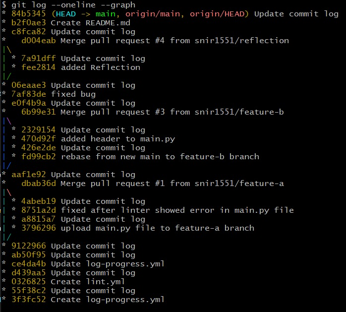
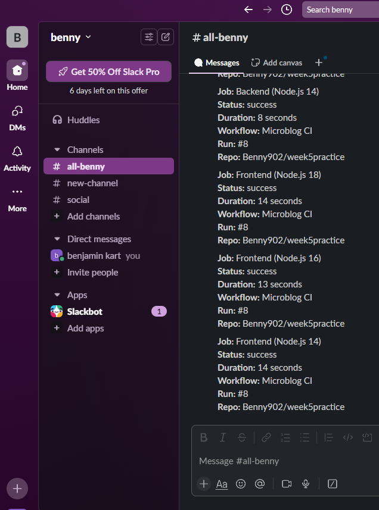
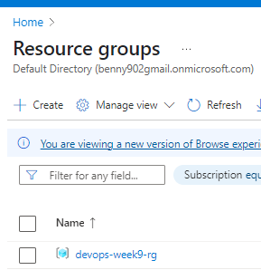
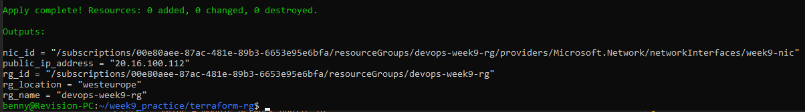

# DevOps-Linux
<br />

<details>
<summary>Week 1 Tasks – Intro to DevOps & Linux</summary>
<br />

## 1. Basic Linux Commands

```bash
# Basic commands to Navigate and manage directories

pwd                   # Print current directory
ls                    # List contents of the directory
mkdir devops_test     # Create new directory
cd devops_test        # Change to that directory
touch testfile.txt    # Create a test file
rm testfile.txt       # Delete the test file
cd ..                 # Go back one directory (can also do cd ../../ and etc)
rm -r devops_test     # Delete the directory
```

## 2. Create Users and Assign to Custom Group

```bash
# Create a new group
sudo groupadd devopsteam

# Create users and assign them to the group
sudo useradd -m -G devopsteam user1
sudo useradd -m -G devopsteam user2

# Verify group membership
groups user1
groups user2
```

## 3. Change File and Directory Permissions

```bash
# Create a directory and a file
mkdir /tmp/secure_folder
touch /tmp/secure_folder/groupfile.txt

# Change ownership to a user and group
sudo chown user1:devopsteam /tmp/secure_folder/groupfile.txt

# Change permissions to allow group read/write
sudo chmod 660 /tmp/secure_folder/groupfile.txt

# Verify permissions
ls -l /tmp/secure_folder/groupfile.txt
```

</details>

******

<details>
<summary>Week 1 Summary Task – DevOps & Linux Basics</summary>
<br />

## Part 1: Creating Directory Structure & Permissions

```bash
# Create base project directory in user's home directory
mkdir -p ~/project1/docs ~/project1/scripts

# Set permissions
chmod 744 ~/project1/scripts  # Owner: rwx, Group/Others: r--
chmod 777 ~/project1/docs     # Everyone: rwx (write access for all users)
```

## Part 2: User & Group Management

```bash
# Create user and group
sudo groupadd devteam
sudo useradd -m -G devteam devuser

# Set 'project1' ownership to your user and give group read-only access
sudo chown $USER:devteam ~/project1
chmod 740 ~/project1  # Owner: rwx, Group: r--, Others: ---
```

## Part 3: Verification Commands

```bash
# Show final directory structure and permissions
ls -lR ~/project1

# Show group membership for devuser
groups devuser
```
Screenshot of the outcome:  

## Command Explanations

- `mkdir -p`: Creates directories; `-p` ensures parent directories are made as needed.
- `chmod 744`: Sets file/directory permissions (`7`=rwx, `4`=r--).
- `chmod 777`: Gives full read/write/execute permissions to all.
- `groupadd`: Adds a new group to the system.
- `useradd -m -G`: Creates a user with a home directory and adds them to a group.
- `chown`: Changes ownership of a file or directory.
- `ls -lR`: Recursively lists directory contents with permissions.
- `groups`: Shows all groups a user belongs to.

> When we use `$USER` it becomes the current username (in my case Benny06nov21).

> We can use 'whoami' to confirm the current username:

</details>

******

<details>
<summary>Week 2 Tasks – Daily Practice Tasks</summary>
<br />

## Task 1: Hello DevOps Script

### Create the Script file `hello_devops.sh`

```bash
nano hello_devops.sh
```

### now we are in the file with nano editor, we can write the script:
```bash
#!/bin/bash
echo "Hello DevOps"
```
* to save press CTRL+O and then press enter.
* then to exit the nano press CTRL+X
* `#!/bin/bash`: Tells the system to use the Bash shell to run this script.

### Make Executable and Run:
```bash
chmod +x hello_devops.sh
./hello_devops.sh
```

---

## Task 2: File & Directory Checker

### Create the Script file same way as in first task: `check_file.sh`
```bash
#!/bin/bash

if [ -z "$1" ]; then
  echo "Usage: ./check_file.sh <filename>"
  exit 1
fi

if [ -f "$1" ]; then
  echo "$1 is a file."
elif [ -d "$1" ]; then
  echo "$1 is a directory."
else
  echo "$1 does not exist."
fi
```
- `$1`: is the first argument passed to the script.
- `-z`: checks if it's an empty string.
- `-f`: checks if a file exists and is a regular file.
- `-d`: checks if the path is a directory.

### Make Executable and Run:
```bash
chmod +x check_file.sh
./check_file.sh hello_devops.sh
```

---

## Task 3: List Files with Sizes

### Create the Script file same way as previous tasks: `list_files.sh`
```bash
#!/bin/bash

printf "%-30s %-10s\n" "Filename" "Size (KB)"
printf "%-30s %-10s\n" "--------" "----------"

for file in *; do
  if [ -f "$file" ]; then
    size=$(du -k "$file" | cut -f1)
    printf "%-30s %-10s\n" "$file" "$size"
  fi
done
```
- `printf "%-30s %-10s\n"`: Prints a formatted line with two columns:
    - %-30s → left-align string to 30 characters (for filename)
    - %-10s → left-align string to 10 characters (for file size)
    - The first two printf lines print the header and underline for the table.
- for file in *: Loops over all items in the current directory (files and folders).
- if [ -f "$file" ]; then: Checks if the item is a regular file (ignores folders).
    - du -k "$file":
    - du = disk usage
- -k = show size in kilobytes (KB)
- `cut -f1`: Cuts the first column of the du output (the size number).
- `size=$(...)`: Stores the file size into a variable called size.
- `printf ... "$file" "$size"`: Prints a row of the table with the filename and its size.

### Make Executable and Run:
```bash
chmod +x list_files.sh
./list_files.sh
```

---

## Task 4: Search for ERROR Logs

### Create a file for testing the script: `access.log`
```bash
cat > access.log << EOF
this is the first line
this is 2nd line with ERROR 
this is ERROR line 
this line has ERROR also
this ERROR line has two ERROR
EOF
```
- total ERROR count is 5, but there 4 lines with ERROR, i will demonstrate the difference below.

### Create the Script file with nano: `find_errors.sh`
```bash
#!/bin/bash

echo "Lines with ERROR:"
grep "ERROR" access.log

echo "Wrong ERROR count:"
grep -c "ERROR" access.log

echo "Correct ERROR count:"
grep -o "ERROR" access.log | wc -l
```
- if using `grep -c "ERROR" access.log` it will return '4' which is incorrect because `-c` Counts matching lines.
- if using `grep -o "ERROR" access.log | wc -l` it will return '5' which is the correct answer because:
    - `-o`: Only print matching parts
    - and then we pipe the result and use `wc -l` to count total matches

### Make Executable and Run::
```bash
chmod +x find_errors.sh
./find_errors.sh
```

---

## Task 5: AWK Column Extractor

### Create a file for testing the one-liner: `data.csv`
```bash
cat > data.csv << EOF
1,Benny,Developer
2,Shalom,Backend
3,Benjamin,DevOps
4,Bennyaaa,Linux
5,BennySh,SoftwareEngineer
EOF
```

### One-liner AWK for `data.csv`:
```bash
awk -F',' '{ print $2 }' data.csv
```

- `awk`: A text-processing tool.
- `-F','`: sets comma as the Separator (instead of the default: spaces).
- `{ print $2 }`: prints the second column.


</details>

******


<details>
<summary>Week 2 Summary Task – Advanced Log Report Automation</summary>
<br />

## Task Overview

creating a modular, user-friendly script that analyzes log files, generates a professional report, and supports dynamic input parameters.

---

## Detailed script with comments:
#### (the clean script file `advanced_log_report.sh` without commnets is in the 'week2_summary' folder)
```bash
#!/bin/bash

# Advanced Log Report Generator

# CONFIG
TIMESTAMP=$(date +"%Y-%m-%d_%H-%M-%S")
REPORT_TXT="report_$TIMESTAMP.txt"
REPORT_CSV="report_$TIMESTAMP.csv"
KEYWORDS=()
LOG_DIR=""
START_TIME=$(date +%s.%N)
COLOR_ON=false
RECURSIVE=false

# print help when using the option '--help'
print_help() {
    echo "Usage: $0 <log_directory> [--keywords KEY1 KEY2 ...] [--recursive] [--color] [--help]"
    echo ""
    echo "Options:"
    echo "  --keywords    List of keywords to search for (for example, ERROR WARNING CRITICAL)"
    echo "  --recursive   Recursively scan all subdirectories"
    echo "  --color       Enable colored terminal output"
    echo "  --help        Display this help message"
    exit 0
}

show_spinner() {
    local filename="$1"
    local spinstr='|/-\\'
    local delay=0.1

    for i in {1..10}; do
        printf "\r[%c] Scanning: %s" "${spinstr:i%4:1}" "$filename" >&1
        sleep $delay
    done
    printf "\r[V] Scanning: %s\n" "$filename"
}

# parsing arguments
parse_args() {
    while [[ $# -gt 0 ]]; do # while still unchecked arguments (args>0)
        case "$1" in
            --keywords)
                shift
                while [[ $# -gt 0 && ! "$1" =~ ^-- ]]; do # while (keywords>0) and current argument ($1) does not start with --
                    KEYWORDS+=("$1") # add the current argument to the KEYWORDS array
                    shift # move to the next argument
                done
                ;;
            --recursive)
                RECURSIVE=true # set flag of recursive to true.
                shift
                ;;
            --color)
                COLOR_ON=true # set flag of color to true.
                shift
                ;;
            --help)
                print_help # calls the print_help function
                ;;
            -*)
                echo "Unknown flag: $1" # if anything else then the known args then exit with error.
                exit 1
                ;;
            *)
                LOG_DIR="$1" # set the log_dir to the first arg
                shift
                ;;
        esac
    done
}

validate_input() {
    if [[ -z "$LOG_DIR" ]]; then
        echo "Error: Log directory not provided."
        exit 1
    fi
    if [[ ! -d "$LOG_DIR" ]]; then
        echo "Error: '$LOG_DIR' is not a valid directory."
        exit 1
    fi
    if [[ ${#KEYWORDS[@]} -eq 0 ]]; then
        echo "Error: No keywords specified."
        exit 1
    fi
}

# Prints the header section for each log file in both TXT and CSV formats
print_header() {
    local filename
    filename=$(basename "$1") # extract just the filename from full path

    # Print formatted header to report.txt
    echo "Log File: $filename" | tee -a "$REPORT_TXT"
    echo "| Keyword     | Occurrences |" | tee -a "$REPORT_TXT"
    echo "|-------------|-------------|" | tee -a "$REPORT_TXT"

    # Write header to CSV
    echo "Log File: $filename" >> "$REPORT_CSV"
    echo "Keyword,Occurrences" >> "$REPORT_CSV"
}

# Prints a single row of keyword and count in both TXT and CSV formats
print_line() {
    local keyword=$1
    local count=$2

    if $COLOR_ON; then  # Print colorized line to terminal and append to report.txt
        printf "| \e[1;33m%-11s\e[0m | \e[1;36m%-11s\e[0m |\n" "$keyword" "$count" | tee -a "$REPORT_TXT"
    else                # Print plain text line and append to report.txt
        printf "| %-11s | %-11s |\n" "$keyword" "$count" | tee -a "$REPORT_TXT"
    fi

    # Write the same data to the CSV report
    echo "$keyword,$count" >> "$REPORT_CSV"
}
# \e[1;33m              - ANSI escape code to set bold yellow text
# %-11s                 - Left-align the string ($keyword and on the other $count) in an 11-character column
# \e[0m                 - Reset formatting (clear color/bold)
# \e[1;36m              - ANSI escape code to set bold cyan text
# tee -a "$REPORT_TXT"  - writes the output to both terminal (stdout) and appends (-a means "append", not overwrite) it to the file $REPORT_TXT


generate_report() {
    # Clear previous report files ('>' overwrites, '>>' appends — here we overwrite)
    echo "" > "$REPORT_TXT"
    echo "" > "$REPORT_CSV"
    
    local files
    # Determine which files to scan based on recursion flag
    if $RECURSIVE; then
        find "$LOG_DIR" -type f -name '*.log'
    else
        find "$LOG_DIR" -maxdepth 1 -type f -name '*.log'
    fi | while IFS= read -r file; do # Process each file found ### 'for' cannot safely handle filenames with spaces or newlines. we must use 'while'
        print_header "$file" # Write file section header

        # Count and write occurrences for each keyword
        for keyword in "${KEYWORDS[@]}"; do  # Loop through each keyword passed via --keywords
            count=$(grep -o "$keyword" "$file" 2>/dev/null | wc -l)  # Count how many times the keyword appears in the file
            print_line "$keyword" "$count"  # Print the result in table format and append to TXT/CSV
        done

        echo ""                     # New line to separate entries in terminal
        echo "" >> "$REPORT_TXT"    # New line in TXT report
        echo "" >> "$REPORT_CSV"    # New line in CSV report
    done
}
# wc -l         - counts how many matches
# 2>/dev/null   - silently suppress error messages from grep when:
## The file can’t be read (e.g., permission denied)
### The file is binary or corrupted
#### grep hits something unexpected and normally prints to stderr

# Calculates and prints the total script execution time
print_execution_time() {
    END_TIME=$(date +%s.%N)  # Capture current time with nanosecond precision
    DURATION=$(echo "$END_TIME - $START_TIME" | bc)  # Subtract start time from end time using bc for float math
    echo "Total Execution Time: ${DURATION} seconds" | tee -a "$REPORT_TXT"  # Print and append the duration to the report
}
# bc handles the subtraction with decimal precision, because Bash can’t subtract floats natively.

main() {
    parse_args "$@"
    validate_input
    generate_report
    print_execution_time
}

# '$@': all the command-line arguments, exactly as passed, preserving quotes.
main "$@"
```

### Key Features
- Accepts a log directory as input
- Supports `--keywords` flag with multiple terms ( `--keywords ERROR WARNING CRITICAL` )
- Recursively scans directories with `--recursive`
- Outputs results to `report.txt` and `report.csv`
- Includes total execution time
- Colored terminal output with `--color`
- Usage guide with `--help`
- Modular structure with clear functions and error handling

---

## Example Usage

```bash
chmod +x advanced_log_report.sh

# Basic usage
./advanced_log_report.sh ./logs --keywords ERROR WARNING CRITICAL

# Recursive search
./advanced_log_report.sh ./logs --keywords ERROR WARNING CRITICAL --recursive

# With color output
./advanced_log_report.sh ./logs --keywords ERROR WARNING CRITICAL --recursive --color

# Show help
./advanced_log_report.sh --help
```


### it will generate two files:
    - `report.txt`: Human-readable summary
    - `report.csv`: Machine-readable CSV format

### view them with cat (or open them manually):
```bash
cat report.txt
cat report.csv
```

</details>

******

<details>
<summary>Week 3 Tasks – Daily Practice Tasks</summary>
<br />

## Task 1: Basic IP & Port Exploration

```bash
ip a              # Show local IP addresses
ifconfig          # Alternate IP viewer (may require net-tools)

netstat -tuln     # List all listening ports (TCP/UDP)
ss -tuln          # Modern alternative to netstat
```

**Explanation of `127.0.0.1:22`:**  
127.0.0.1 this IP address is a loopback address that points to the computer, smartphone, or tablet you are using, and is also called localhost.  
Port 22 is dedicated to Secure Shell (SSH), which allows you to securely connect to a remote device and issue commands as if you were in front of it.

---

## Task 2: Generate SSH Key & Connect (+Task 3: Create Azure VM)

### Generate the SSH key:
```bash
ssh-keygen -t rsa -b 2048 -f ~/.ssh/id_rsa
```
and then presse 'enter' to accept the file location.  
and again press 'enter' two times to skip setting passphrase.

### Script to create an Azure Linux VM and Add this public key to the VM
```bash
#!/bin/bash

# Set variables
RESOURCE_GROUP="bennyVMeastus2"
LOCATION="eastus2" # cheapest for Standard_B1ls as i saw in pricing
VM_NAME="myvm"
ADMIN_USER="azureuser"

# Create resource group
az group create --name "$RESOURCE_GROUP" --location "$LOCATION"

# Create VM # Standard_B1ls is the cheapest.
az vm create \
  --resource-group "$RESOURCE_GROUP" \
  --name "$VM_NAME" \
  --image Ubuntu2204 \
  --size Standard_B1ls \
  --admin-username "$ADMIN_USER" \
  --authentication-type ssh \
  --generate-ssh-keys

# Add the public key to the VM (from ~/.ssh/id_rsa.pub)
az vm user update \
  --resource-group "$RESOURCE_GROUP" \
  --name "$VM_NAME" \
  --username "$ADMIN_USER" \
  --ssh-key-value "$(cat ~/.ssh/id_rsa.pub)"

# Open SSH port 22 (if not already open)
az vm open-port --port 22 --resource-group "$RESOURCE_GROUP" --name "$VM_NAME"
```

### Run the Script:
```bash
chmod +x create_vm_and_add_public_key.sh
./create_vm_and_add_public_key.sh
```

### Connect to the Azure VM without password:
```bash
ssh azureuser@<vm-public-ip>
```

---


## Task 4: Remote File Transfer with SCP

```bash
# if we are connected to the azure, we need to 'exit' to return to the local wsl
exit 

# Upload file
scp myfile.txt azureuser@<vm-public-ip>:/home/azureuser/

# Download file back to a different local path
scp azureuser@<vm-public-ip>:/home/azureuser/myfile.txt myfile_copied.txt

```

---

## Task 5: Run a Remote Command via SSH

```bash
# Run commands remotely
ssh -t azureuser@<vm-public-ip> "uptime"
ssh -t azureuser@<vm-public-ip> "df -h"
ssh -t azureuser@<vm-public-ip> "ls -l /home/azureuser"

# Save output locally
ssh -t azureuser@<vm-public-ip> "df -h" > vm_disk_usage.txt
```

</details>

******

<details>
<summary>Week 3 Summary Task – Remote Log
Monitoring with SSH & VM </summary>
<br />

## Task Objective:
This task is designed to consolidate the skills learned throughout Week 3 and apply them
in a practical, real-world DevOps scenario. You will connect to a remote virtual machine
using SSH, retrieve log files, analyze them for critical patterns (e.g., ERROR,
WARNING), and produce professional reports in both human-readable TXT and CSV
formats. This exercise reinforces concepts from previous weeks—including Bash
scripting, keyword parsing, working with files, and now adds secure networking and
virtual infrastructure access.

## Before we start, need to make sure you can connect to the VM without password:
(further instructions are in 'week3 - Daily Practice Tasks' above)
```bash
ssh azureuser@<vm-public-ip>
```
* after verifying, now we can `exit`

## Now we send some logs to the VM:
Script: `upload_logs_to_vm.sh`:
```bash
#!/bin/bash

REMOTE="$1"
LOCAL_FOLDER="$2"
REMOTE_FOLDER="$3"

if [[ -z "$REMOTE" || -z "$LOCAL_FOLDER" || -z "$REMOTE_FOLDER" ]]; then
  echo "Usage: $0 <user@host> <local_folder> <remote_folder>"
  echo "Example: $0 azureuser@52.1.2.3 ./logs /home/azureuser/logs_target"
  exit 1
fi

if [[ ! -d "$LOCAL_FOLDER" ]]; then
  echo "Error: '$LOCAL_FOLDER' is not a valid local directory"
  exit 1
fi

# Strip trailing slash if present
LOCAL_FOLDER="${LOCAL_FOLDER%/}"

# Ensure remote folder exists
ssh "$REMOTE" "mkdir -p \"$REMOTE_FOLDER\""

echo "Uploading '$LOCAL_FOLDER/' to $REMOTE:$REMOTE_FOLDER ..."
rsync -avz --progress "$LOCAL_FOLDER/" "$REMOTE:$REMOTE_FOLDER/"

echo "Upload complete → $REMOTE:$REMOTE_FOLDER"
```
- `-a` archive mode: preserves permissions, timestamps, symbolic links, etc.

- `-v` verbose: prints what’s happening.

- `-z` compress: compresses file data during the transfer for efficiency.

- `--progress` shows real-time progress of file transfers.

- `"$LOCAL_FOLDER/"` Trailing slash means “copy contents of the folder” (not the folder itself).

- `"$REMOTE:$REMOTE_FOLDER/"` Specifies the remote user/host and destination directory.

### Usage:
```bash
chmod +x upload_logs_to_vm.sh
./upload_logs_to_vm.sh <user@host> <local_folder> <remote_folder>
```

## Example:
```bash
./upload_logs_to_vm.sh azureuser@13.68.110.243 ./logs_to_upload /home/azureuser/logs_in_remote
```

## Now we can get logs from the VM:
Script: `remote_wrapper.sh`:
```bash
#!/bin/bash

# Remote Wrapper for Local Log Analyzer
## Downloads log files from a remote server, extracts archives,
## and invokes the local advanced_log_report.sh analyzer script.

# CONFIG
TIMESTAMP=$(date +"%Y-%m-%d_%H-%M-%S")  # Current timestamp for folder uniqueness
TMP_DIR="./tmp_logs_$TIMESTAMP"         # Temporary directory for downloaded/extracted logs
START_TIME=$(date +%s.%N)               # Start time for execution duration

# Print usage instructions
print_help() {
    echo "Usage: $0 <remote_user@host> <remote_log_dir> --keywords KEY1 [KEY2 ...] [--recursive] [--color]"
    echo ""
    echo "Positional arguments:"
    echo "  <remote_user@host>       Remote SSH login"
    echo "  <remote_log_dir>         Remote directory containing logs"
    echo ""
    echo "Options (passed to advanced_log_report.sh):"
    echo "  --keywords KEY1 [...]    Required keywords to search for"
    echo "  --recursive              Recursively scan subdirectories"
    echo "  --color                  Enable colored output"
    echo "  --help                   Show this help message"
    exit 1
}

# Validate argument count and check for --help flag
if [[ "$#" -lt 3 || "$1" == "--help" ]]; then # if args less than 3 or the first argument is --help
    print_help
fi

# Ensure required --keywords argument exists
if ! printf '%s\n' "$@" | grep -q -- "--keywords"; then
    echo "Error: Missing required --keywords argument."
    print_help
fi
# -q means “quiet” (no output, just sets exit code if found/not found), and when grep sees -- and stops treating further arguments as options.

# Extract and shift positional arguments
REMOTE_HOST="$1"       # Remote SSH login (e.g. user@host)
REMOTE_DIR="$2"        # Path to remote directory with logs
shift 2
PASSTHRU_ARGS=("$@")   # All remaining arguments passed to local analyzer

# Download logs and archives from the remote server
download_logs() {
    mkdir -p "$TMP_DIR"  # Create TMP_DIR if it doesn't exist (-p means no error if it exists)
    echo "[*] Downloading logs and archives..."
    
    # Run a remote 'find' via SSH: list all .log, .zip, .tar, .tar.gz files under REMOTE_DIR (escaped parentheses and quotes for correct remote parsing)
    ssh "$REMOTE_HOST" "find \"$REMOTE_DIR\" -type f \\( -iname '*.log' -o -iname '*.zip' -o -iname '*.tar' -o -iname '*.tar.gz' \\)" > /tmp/remote_log_list.txt # ">" overwrite if exists.

    # Read each line (remote file path) from the log list
    while IFS= read -r remote_file; do
        echo "[Downloading] $remote_file"
        # Try rsync for efficient copying:
        # -a (archive, preserves attributes), -v (verbose), -z (compress), --protect-args (handle spaces/special chars)
        # 2>/dev/null hides rsync errors (so script can fallback to scp)
        rsync -avz --protect-args "$REMOTE_HOST:$remote_file" "$TMP_DIR/" 2>/dev/null || \
        # If rsync fails (exit code not zero), use scp as fallback
        # -q (quiet), quotes protect spaces in remote path
        scp -q "$REMOTE_HOST:\"$remote_file\"" "$TMP_DIR/"
    done < /tmp/remote_log_list.txt
}
# Use rsync first for its efficiency (only transfers changes, can resume, preserves file attributes, handles spaces, and provides progress output).
# Fall back to scp for compatibility on systems where rsync is not installed or unavailable.

# Extract all supported archive types (.zip, .tar, .tar.gz)
extract_archives() {
    echo "[*] Extracting archives..."
    find "$TMP_DIR" -type f \( -iname "*.zip" -o -iname "*.tar" -o -iname "*.tar.gz" \) | while read -r archive; do
        case "$archive" in
            *.zip) unzip -q "$archive" -d "$TMP_DIR" ;; # in unzip -d is directory
            *.tar) tar -xf "$archive" -C "$TMP_DIR" ;; # but in tar its -C ## -x (extract), -f (archive file).
            *.tar.gz) tar -xzf "$archive" -C "$TMP_DIR" ;; # same here -C . ## -x (extract), -z (gzip support), -f (archive file).
        esac
    done
}

# Run the local analyzer script on the downloaded and extracted logs
run_local_analyzer() {
    echo "[*] Running local analyzer..."
    chmod +x ./advanced_log_report.sh
    ./advanced_log_report.sh "$TMP_DIR" "${PASSTHRU_ARGS[@]}"
}

# Main flow
main() {
    download_logs
    extract_archives
    run_local_analyzer
}

main
```
### Key Features
- Connects to a remote server via SSH (<user@host>)
- Accepts a remote log directory path as positional input
- Automatically downloads .log, .zip, .tar, and .tar.gz files
- Supports recursive scanning of subdirectories with --recursive
- Extracts archives locally before analysis
- Passes all flags (--keywords, --color, etc.) to the local analyzer (advanced_log_report.sh)
- Accepts --keywords with one or more terms (e.g. --keywords ERROR WARNING)
- Produces structured output: remote_report_*.txt and remote_report_*.csv (via delegated script)
- Displays execution progress with clear status messages and spinners
- Includes built-in --help with usage examples
- Modular function-based architecture for clean maintenance and extension


## Script Usage
```bash
sudo apt install unzip # the script uses unzip
chmod +x remote_wrapper.sh
./remote_wrapper.sh <remote_user@host> <remote_log_dir> [--keywords KEY1 KEY2 ...] [--recursive] [--color] [--help]
```

### Example:
```bash
./remote_wrapper.sh azureuser@13.68.110.243 /home/azureuser/logs_in_remote --keywords ERROR WARNING CRITICAL --recursive --color
```

</details>

******

<details>
<summary>Week 4 Tasks – Daily Practice Tasks </summary>
<br />

## Task 1: Branching & Switching
Initialize a new local Git repository:
```bash
git init
echo "# Week 4 Git Practice" > README.md
git add README.md
git commit -m "init"
```

Create two branches:
```bash
git checkout -b feature-a
git checkout -b feature-b
```

Switch between them:
```bash
git switch feature-a
# or
git checkout feature-a
```

Make a change on each branch and commit:
```bash
echo "Change for feature-a" >> file.txt
git add file.txt
git commit -m "Add feature-a change"
```

---

## Task 2: Simulate and Resolve Merge Conflicts
In both branches, edit the **same line** in `file.txt` to different content.

Merge one branch into the other and observe the conflict:
```bash
git checkout feature-a
git merge feature-b
```

Resolve the conflict manually in the editor or using:
```bash
git status
# Edit the file to fix conflicts
git add file.txt
git commit -m "Resolve merge conflict"
```
after `git add file.txt` and `git commit -m "Resolve merge conflict"` Git stores the resolved version and finalizes the merge.

---

## Task 3: Rebase and Cherry-Pick
before the rebase, we can view the log history by `git log --oneline`:
>$ git log --oneline  
>1605d5c (HEAD -> feature-a) Resolve merge conflict  
>97cdfc0 (feature-b) Add feature-a change  
>84a807b Add feature-a change  
>b4b7a66 (master) init  


Rebase `feature-a` onto `master`:
```bash
git checkout feature-a
git rebase master
```

if we have conflict we have few options:  
- we can resolve the conflict and then use `git rebase --continue` to continue with the rebase.
- we can skip the commit with the conflict it `git rebase --skip`.
- or we can abord the rebase with `git rebase --abort`.

i had conflict, so using the editor i made a combination of both features in the file.txt.  
and now to view the changes and the commit history log history again by `git log --oneline`:
>$ git log --oneline  
>dff5c7e (HEAD -> feature-a) add feature-a and feature-b change  
>84a807b Add feature-a change  
>b4b7a66 (master) init  

Cherry-pick a single commit from `feature-b`:
```bash
git checkout master
git cherry-pick <commit-hash>
```
if we want to cancel it we can do `git reset --hard HEAD~1`.  
This will delete the last commit and reset your branch to its previous state.


- `merge`: Adds both of the branches histories together with a special "merge commit."
- `rebase`: Moves the commits on top of the target branch, making it a straight timeline.

---

## Task 4: GitHub Pull Requests & Code Review
We can view all our branches by:
```bash
git branch # see all local branches
git branch -a # see local and remote branches
```

create remote repository (or in github UI):
```bash
gh repo create <repo_name> --public --source=. --remote=origin --push
```

Add the remote repository and push all branches:
```bash
git remote add origin https://github.com/<username>/<repo_name>.git
git push --all origin
```

can choose which branch to be the default (im changing to master):
```bash
gh repo edit --default-branch master
```

Create a pull request from `feature-a` into `master`:
```bash
gh pr create --base master --head feature-a --title "Merge feature-a" --body "This pull request merges feature-a into master."
```

---

## Task 5: Stash, Amend, and Cleanup
Make local changes and stash them:
```bash
echo "Temporary change" >> temp.txt
git add temp.txt
git stash
```

Restore the stash:
```bash
git stash pop
```

Amend the last commit:
```bash
git commit --amend -m "Updated commit message"
```

Clean up local branches already merged:
```bash
git branch --merged
git branch -d feature-b
```

</details>

******

<details>
<summary>Week 4 Summary Task – GitHub Collaboration Simulation </summary>
<br />

## Overview

### https://github.com/snir1551/week4-collaboration

This repository demonstrates a real-world collaborative Git workflow with a focus on:
- Branching and feature development.
- Conflict simulation and resolution.
- Using `rebase` and `cherry-pick` .
- Clean commit history and code review.
- Automations: GitHub Actions for linting and logging (permission given through the Settings in github).


## Repository & Branch Setup
```bash
gh repo create week4-collaboration --public --source=. --remote=origin --push
# or via GitHub UI

git branch feature-a
git branch feature-b
```

## Simulate a Merge Conflict
Edit the same line in a shared file (e.g., main.py) on both feature-a and feature-b.
```bash
git checkout feature-a
nano main.py # and write the below, and then alt+o , enter , alt+x
print("Hello from feature-a")
git add main.py
git commit -m "update main.py from feature-a"
git push -u origin feature-a

git checkout feature-b
nano main.py # and write the below, and then alt+o , enter , alt+x
print("Hello from feature-b")
git add main.py
git commit -m "update main.py from feature-b"
git push -u origin feature-b
```

## Open PR on first branch 'feature-a' and Merge to main
```bash
gh pr create --base main --head feature-a --title "Merge feature-a" --body "Add feature-a changes"
```
- Snir assigned me as reviewer and used labels for PR.  
- PR Approved and merged to main.

## Rebase feature-b branch based on new main (after merged the feature-a)
```bash
git checkout main
git pull
git checkout feature-b
git rebase main
# Resolve conflicts if any, (for example we edited the main.py)
# and then we did `git rebase --continue` to continue.
git push
```

## Open PR on second branch 'feature-b' and Merge to main
```bash
gh pr create --base main --head feature-b --title "Merge feature-b" --body "Add feature-b changes"
```
Assigned Snir as reviewer and used labels for PR.  
PR Approved and merged to main.


## added third branch to simulate cherry-pick:
we used cherry-pick to get some 'bug fix' from a branch with multiple commits: git cherry-pick bffbf23
```bash
git checkout main
git log --oneline --graph --all # used to see all the commit hash's
git cherry-pick <commit-hash> # git cherry-pick bffbf23 
git push
```
- https://github.com/snir1551/week4-collaboration/commit/7af83de4809c3ea30554f017959b2a48ada57473


## git log graph


## Added `REFLECTION.md`:
- What was the most challenging Git concept this week?
	1. the most challenging concept was understanding the Rebase concept and when its best to use it and how exactly.


- What did you learn about collaboration? 
	1. we learned that we need to have good communication in order to not cause conflict by working on same files or branchs,
and also make the work faster and more efficient by allowing each of the collaborator to work on different feature.
	2. that we should create issue before creating a pull request.


- What mistakes did you make and how did you fix them? 
	1. we didnt pull the recent changes from main before trying to apply changes from new branchs, which made problems

	2. we accidently commited and pushed to the wrong branch, and we fixed it by using git reset --hard HEAD~1


</details>


******

<details>
<summary>Week 5 Tasks – Daily Practice Tasks </summary>
<br />

# CI/CD with GitHub Actions
repo with the cicd implementations: https://github.com/Benny902/week5practice

## Task 1: Introduction to GitHub Actions

- **What is a GitHub Action?**  
  A GitHub Action is an automated workflow step or script that runs in response to events (like code pushes, pull requests, or issues). It’s used for tasks like building, testing, and deploying the application.

- **What is the difference between a job and a step?**  
  - A **job** is a set of steps that run on the same runner (virtual machine). Jobs run in parallel by default.  
  - A **step** is a single task within a job (like `npm install` or `echo "Hello"`). Steps run sequentially within a job.

- **What triggers a workflow?**  
  Workflows are triggered by events (like `push`, `pull_request`, `workflow_dispatch`), a schedule (cron), or manually from the GitHub Actions UI.

---

## Task 2: Basic CI Pipeline for Testing
1. In the project’s root, creating a new folder `.github/workflows`.  
2. Inside `.github/workflows`, create a file named `ci.yml`.  
3. A template for a Node.js app:

```yaml
name: CI Pipeline

on: # Runs on every push and pull request
  push:
  pull_request:

jobs:
  test:
    runs-on: ubuntu-latest
    steps:
      - uses: actions/checkout@v3
      - name: Set up Node.js
        uses: actions/setup-node@v3
        with:
          node-version: '18'
      - run: npm install # Installs dependencies
      - run: npm test # Runs test script
```

---

## Task 3: Matrix Strategy
1. modifying the `ci.yml` file to include a matrix strategy:  

```yaml
    strategy:
      matrix: # Defines a matrix for versions
        node-version: [14, 16, 18]

    steps:
        with:
          node-version: ${{ matrix.node-version }}
```
we can confirm the workflow runs once for each version by checking the 'GitHub Actions' run results.  
for example in my case: https://github.com/Benny902/week5practice/actions/runs/15419936970

---

## Task 4: Artifacts and Post-job Monitoring

In the **backend job**, we add a step to upload the test log file as an artifact:  

```yaml
- name: Upload test results
  uses: actions/upload-artifact@v4
  with:
    name: backend-test-results-node${{ matrix.node-version }}
    path: backend/test-results.log
```
we can download an artifact zip file from the link above, and see it has 'test-results.log' file inside of it.


In the **frontend job**, we validate availability with `curl -I http://localhost:4000`.

---

## Task 5: Slack/Discord Integration
1. Integrate the workflow with Slack (i chose Slack)
2. Store the webhook URL in the GitHub repo secrets (`SLACK_WEBHOOK_URL`).  
3. Add a Slack notification step to the workflow:  

add to the yaml for slack:
```yaml
- name: Notify Slack (Backend)
  if: always()
  uses: slackapi/slack-github-action@v1.25.0
  with:
    payload: |
    {
        "text": "*Job:* Backend (Node.js ${{ matrix.node-version }})\n*Status:* ${{ job.status }}\n*Duration:* ${{ env.JOB_DURATION }} seconds\n*Workflow:* ${{ github.workflow }}\n*Run:* #${{ github.run_number }}\n*Repo:* ${{ github.repository }}"
    }
  env:
    SLACK_WEBHOOK_URL: ${{ secrets.SLACK_WEBHOOK_URL }}

- name: Notify Slack (Frontend)
  if: always()
  uses: slackapi/slack-github-action@v1.25.0
  with:
    payload: |
    {
        "text": "*Job:* Frontend (Node.js ${{ matrix.node-version }})\n*Status:* ${{ job.status }}\n*Duration:* ${{ env.JOB_DURATION }} seconds\n*Workflow:* ${{ github.workflow }}\n*Run:* #${{ github.run_number }}\n*Repo:* ${{ github.repository }}"
    }
  env:
    SLACK_WEBHOOK_URL: ${{ secrets.SLACK_WEBHOOK_URL }}
```
Screenshot of the outcome:  
 

---

## Task 6: Combined Frontend and Backend CI/CD
1. created simple backend and frontend folder and files
2. enhanced the yml, this is the final yml file:
```yaml
name: Microblog CI

on: # Runs on every push and pull request
  push:
  pull_request:

jobs:
  backend:
    runs-on: ubuntu-latest
    strategy:
      matrix: # Matrix strategy to test multiple Node.js versions
        node-version: [14, 16, 18]
    steps:
      - uses: actions/checkout@v3 # Check out the code from the repo
      - name: Set job start time
        run: echo "JOB_START_TIME=$(date +%s)" >> $GITHUB_ENV # Record the start time in seconds and store it in GitHub Actions environment variable

      - name: Set up Node.js
        uses: actions/setup-node@v3 # Use the official Node.js setup action
        with:
          node-version: ${{ matrix.node-version }} # Use the Node.js version from the matrix

      - name: Install backend dependencies
        run: |
          cd backend # Move into the backend directory
          npm install # Install npm dependencies

      - name: Run backend tests
        run: |
          cd backend
          npm test | tee test-results.log # Run tests and write output to test-results.log
          echo "Build finished successfully at $(date)" >> test-results.log 
      - name: Upload test results
        uses: actions/upload-artifact@v4 # Upload the artifact to GitHub Actions
        with:
          name: backend-test-results-node${{ matrix.node-version }} # Artifact name includes the Node.js version
          path: backend/test-results.log # Path of the file to upload

      - name: Calculate job duration
        run: echo "JOB_DURATION=$(( $(date +%s) - $JOB_START_TIME ))" >> $GITHUB_ENV # Calculate duration in seconds and store in environment variable

      - name: Notify Slack (Backend)
        if: always() # Always run this step (even if previous steps fail)
        uses: slackapi/slack-github-action@v1.25.0 # Use official Slack GitHub Action
        with:
          payload: |
            {
              "text": "*Job:* Backend (Node.js ${{ matrix.node-version }})\n*Status:* ${{ job.status }}\n*Duration:* ${{ env.JOB_DURATION }} seconds\n*Workflow:* ${{ github.workflow }}\n*Run:* #${{ github.run_number }}\n*Repo:* ${{ github.repository }}"
            } # Slack message payload includes job info and duration
        env:
          SLACK_WEBHOOK_URL: ${{ secrets.SLACK_WEBHOOK_URL }} # Slack webhook URL stored in GitHub secrets

      - name: Echo job completion
        if: success() # Only run if job was successful
        run: echo "Backend job for Node.js ${{ matrix.node-version }} completed successfully!" # Bash echo to log success message

  frontend:
    runs-on: ubuntu-latest
    strategy:
      matrix:
        node-version: [14, 16, 18]
    steps:
      - uses: actions/checkout@v3 # Checkout the frontend code
      - name: Set job start time
        run: echo "JOB_START_TIME=$(date +%s)" >> $GITHUB_ENV # Record the job start time

      - name: Set up Node.js
        uses: actions/setup-node@v3
        with:
          node-version: ${{ matrix.node-version }} # Use matrix version

      - name: Install frontend dependencies
        run: |
          cd frontend
          npm install # Install any frontend dependencies

      - name: Serve frontend for testing # Start a local server and check if it's running
        run: |
          cd frontend
          node server.js & # Start server in background (&) so next command can run
          sleep 3 # Wait 3 seconds for server to start
          curl -I http://localhost:4000 # Use curl to check if server is up (HEAD request)

      - name: Calculate job duration
        run: echo "JOB_DURATION=$(( $(date +%s) - $JOB_START_TIME ))" >> $GITHUB_ENV # Calculate how long the job took

      - name: Notify Slack (Frontend)
        if: always() # Always send Slack message
        uses: slackapi/slack-github-action@v1.25.0
        with:
          payload: |
            {
              "text": "*Job:* Frontend (Node.js ${{ matrix.node-version }})\n*Status:* ${{ job.status }}\n*Duration:* ${{ env.JOB_DURATION }} seconds\n*Workflow:* ${{ github.workflow }}\n*Run:* #${{ github.run_number }}\n*Repo:* ${{ github.repository }}"
            }
        env:
          SLACK_WEBHOOK_URL: ${{ secrets.SLACK_WEBHOOK_URL }}

      - name: Echo job completion
        if: success()
        run: echo "Frontend job for Node.js ${{ matrix.node-version }} completed successfully!" # Echo final success message for the job

```

</details>

******

<details>
<summary>Week 5 Summary Task – </summary>
<br />

https://github.com/Benny902/week5-ci-cd

</details>

******

<details>
<summary>Week 6 Tasks – Daily Practice Tasks</summary>
<br />

# Docker & Containers Practice  
Repo: https://github.com/Benny902/week6practice

---

## Task 1 – Introduction to Docker CLI

- Install Docker from [https://docs.docker.com/get-docker/](https://docs.docker.com/get-docker/)
- Run first container:
  ```bash
  docker run hello-world
  ```
- Basic Docker CLI commands:
  ```bash
  docker ps        # List running containers
  docker ps -a     # List all containers (including stopped)
  docker images    # List downloaded images
  docker stop <container_id>   # Stop a running container
  docker rm <container_id>     # Remove a container
  docker rmi <image_id>        # Remove an image
  ```

---

## Task 2 – Working with Docker Images

- Pull and run an NGINX container:
  ```bash
  docker run -d -p 8080:80 nginx
  ```
- Open `http://localhost:8080` in your browser or:
  ```bash
  curl http://localhost:8080
  ```

- Use a lightweight image:
  ```bash
  docker pull nginx:alpine
  docker image ls
  ```
  Compare image sizes between `nginx` and `nginx:alpine`:
```bash
  $   docker image ls
REPOSITORY      TAG IMAGE       ID              CREATED         SIZE
nginx           latest          be69f2940aaf    7 weeks ago     192MB
nginx           alpine          6769dc3a703c    7 weeks ago     48.2MB
```

---

## Task 3 – Dockerfile Basics

1. Create a `Dockerfile` for a simple Node.js app:

**Example: Node.js App**

```Dockerfile
FROM node:alpine
WORKDIR /app
COPY . .
RUN npm install
CMD ["node", "server.js"]
```

2. Example `server.js`:

```js
import * as http from 'http';

const PORT = 5000;
http.createServer((req, res) => {
  console.log(`${req.method} ${req.url}`);
  res.end('Hello from Docker');
}).listen(PORT, () => {
  console.log(`Server running on port ${PORT}`);
});
```

3. Build and run:

```bash
docker build -t mynodeapp .
docker run -p 5000:5000 mynodeapp
```

4. Add `.dockerignore`:
```
node_modules
.env
```
### How `.dockerignore` affects build context:  
This will prevent the node_modules and .env files from being copied into the Docker image.  
- This reduces build context size (making builds faster).  
- `node_modules`: It ensures Docker installs fresh dependencies inside the container, avoiding possible OS or version conflicts.  
- keep sensitive files (like .env) out of production image.

---

## Task 4 – Custom Networking and Multi-container Setup

- Create a network:
  ```bash
  docker network create mynet
  ```

- Run two containers on the same network:
  ```bash
  docker run -d --name db --network mynet mongo
  docker run -it --rm --network mynet mongo mongosh --host db
  ```

- Use container names (`db`) to connect internally.

---

## Task 5 – Docker Compose Intro

1. `docker-compose.yml` example:
```yaml
version: '3'
services:
  web:
    build: .
    ports:
      - "5000:5000"
    environment:
      - APP_ENV=dev
    depends_on:
      - db
  db:
    image: mongo
    volumes:
      - dbdata:/data/db
volumes:
  dbdata:
```

2. Run:
```bash
docker-compose up --build
```

3. to test that web service can communicate with the database i enhanced the `server.js` with:
```js
import mongoose from 'mongoose';

mongoose.connect('mongodb://db:27017/mydb')
  .then(() => console.log("It works!"))
  .catch(err => console.log("Mongo connection failed:", err.message));
```
and now when we run with 'docker-compose up --build' we will see `It works!` in the logs

---

## Task 6 – Monitoring & Logging Basics

- Add to the `Dockerfile`:
```Dockerfile
HEALTHCHECK --interval=30s --timeout=5s --retries=3 CMD curl -f http://localhost:5000/ || exit 1
```

- Log HTTP requests in the app (already included in `server.js` above).
- Use:
```bash
docker ps
docker logs <container_id>
docker inspect <container_id>
```

---

## Task 7 – Advanced Docker Features

- Tag your image:
```bash
docker tag mynodeapp mynodeapp:1.0.0
```

- Push to Docker Hub (optional):
```bash
docker login
docker push mynodeapp:1.0.0
```

- Use optimized base images: (we already using this)
```Dockerfile
FROM node:alpine
```

- Simulate Slack notification (example):
```bash
curl -X POST -H 'Content-type: application/json' \
  --data '{"text":"Build finished successfully!"}' \
  https://hooks.slack.com/services/XXX/YYY/ZZZ
```

- Bonus app healthcheck endpoint (optional improvement):
```js
  hitCount++; // add `var hitCount = 0;` above this scope 
  console.log(`Hit #${hitCount} - ${req.method} ${req.url}`);

  if (req.url === '/health') {
    // 20% chance to simulate a failure (for healthcheck testing)
    if (Math.random() < 0.2) {
      res.statusCode = 500;
      res.end('Not Healthy');
    } else {
      res.statusCode = 200;
      res.end('Healthy!');
    }
    return;
  }
```

### now when we test with `curl -i http://localhost:5000/health`, we can see some results:
in logs
```bash
web-1  | Hit #3 - GET /health
web-1  | Hit #4 - GET /favicon.ico
web-1  | GET /favicon.ico
web-1  | Hit #5 - GET /health
web-1  | Hit #6 - GET /favicon.ico
web-1  | GET /favicon.ico
web-1  | Hit #7 - GET /health
web-1  | Hit #8 - GET /favicon.ico
web-1  | GET /favicon.ico
web-1  | Hit #9 - GET /health
web-1  | Hit #10 - GET /favicon.ico
web-1  | GET /favicon.ico
```

in bash:
```bash
Benny06nov21@Revision-PC MINGW64 ~
$ curl -i http://localhost:5000/health
  % Total    % Received % Xferd  Average Speed   Time    Time     Time  Current
                                 Dload  Upload   Total   Spent    Left  Speed
100     8  100     8    0     0   3029      0 --:--:-- --:--:-- --:--:--  4000HTTP/1.1 200 OK
Date: Tue, 10 Jun 2025 10:56:40 GMT
Connection: keep-alive
Keep-Alive: timeout=5
Content-Length: 8

Healthy!
Benny06nov21@Revision-PC MINGW64 ~
$ curl -i http://localhost:5000/health
  % Total    % Received % Xferd  Average Speed   Time    Time     Time  Current
                                 Dload  Upload   Total   Spent    Left  Speed
100    11  100    11    0     0   4160      0 --:--:-- --:--:-- --:--:--  5500HTTP/1.1 500 Internal Server Error
Date: Tue, 10 Jun 2025 10:56:40 GMT
Connection: keep-alive
Keep-Alive: timeout=5
Content-Length: 11

Not Healthy
Benny06nov21@Revision-PC MINGW64 ~
$ curl -i http://localhost:5000/health
  % Total    % Received % Xferd  Average Speed   Time    Time     Time  Current
                                 Dload  Upload   Total   Spent    Left  Speed
100     8  100     8    0     0   3153      0 --:--:-- --:--:-- --:--:--  4000HTTP/1.1 200 OK
Date: Tue, 10 Jun 2025 10:56:41 GMT
Connection: keep-alive
Keep-Alive: timeout=5
Content-Length: 8

Healthy!
```

</details>

******

<details>
<summary> Week 6 Summary Task – Docker & Containerization </summary>
<br />

- repo: https://github.com/Benny902/week6-ci-cd-docker
- has detailed readme on the repo above.

</details>

******

<details>
<summary> Week 7 - daily Tasks </summary>
<br />
https://github.com/Benny902/week7practice


</details>

******

<details>
<summary> Week 7 - Summary Task: Docker Compose & Azure + VM </summary>
<br />
https://github.com/Benny902/week7-collab


</details>

******


<details>
<summary> Week 8 - daily Tasks </summary>
<br />

# WEEK 8 – Daily Practice Tasks: Azure Infrastructure


## Task 1 – Setup Azure CLI Environment
```bash
# to login:
az login --use-device-code

# to see list of accounts associated
az account list --output table

# to choose which one to apply
az account set --subscription "YOUR_SUBSCRIPTION_NAME"
```

---

## Task 2 – Use the Azure CLI to create a resource group and a basic Linux VM.

### Generate the SSH key:
```bash
ssh-keygen -t rsa -b 2048 -f ~/.ssh/id_rsa
```
and then presse 'enter' to accept the file location.  
and again press 'enter' two times to skip setting passphrase.

### Script to create an Azure Linux VM and Add this public key to the VM
`create_vm_and_add_public_key.sh`:
```bash
#!/bin/bash

# Set variables
RESOURCE_GROUP="bennyVMeastus2"
LOCATION="eastus2" # cheapest for Standard_B1ls as i saw in pricing
VM_NAME="myvm"
ADMIN_USER="azureuser"

# Create resource group
az group create --name "$RESOURCE_GROUP" --location "$LOCATION"

# Create VM # Standard_B1ls is the cheapest.
az vm create \
  --resource-group "$RESOURCE_GROUP" \
  --name "$VM_NAME" \
  --image Ubuntu2204 \
  --size Standard_B1ls \
  --admin-username "$ADMIN_USER" \
  --authentication-type ssh \
  --generate-ssh-keys

# Add the public key to the VM (from ~/.ssh/id_rsa.pub)
az vm user update \
  --resource-group "$RESOURCE_GROUP" \
  --name "$VM_NAME" \
  --username "$ADMIN_USER" \
  --ssh-key-value "$(cat ~/.ssh/id_rsa.pub)"

# Open SSH port 22 (if not already open)
az vm open-port --port 22 --resource-group "$RESOURCE_GROUP" --name "$VM_NAME"
```

### Run the Script:
```bash
chmod +x create_vm_and_add_public_key.sh
./create_vm_and_add_public_key.sh
```

---

## Task 3 – Configure Networking (NSG + Public IP)

### Get Network Info:
```bash
az network nic list --resource-group bennyVMeastus2 -o table
az network public-ip show --resource-group bennyVMeastus2 --name myVMPublicIP -o json
```

### Add NSG Rule to Allow HTTP (port 80):
```bash
az network nsg rule create \
  --resource-group bennyVMeastus2 \
  --nsg-name myVMNSG \
  --name Allow-HTTP \
  --priority 1001 \
  --access Allow \
  --direction Inbound \
  --protocol Tcp \
  --destination-port-range 80 \
  --source-address-prefixes '*' \
  --destination-address-prefixes '*'
```
- Replace `myVMNSG` with the correct NSG name (check using az network nsg list).

---

## Task 4 – Deploy a Simple Web App to the VM

### Get the public IP of the VM with this command:
```bash
az vm show \
  --resource-group bennyVMeastus2 \
  --name myvm \
  -d \
  --query publicIps \
  -o tsv
```

### Connect to the Azure VM without password:
```bash
ssh azureuser@<vm-public-ip>
```

### Install Docker & Docker Compose
```bash
# Update package info
sudo apt update

# Install Docker
sudo apt install -y docker.io

# Enable and start Docker
sudo systemctl enable docker
sudo systemctl start docker

# Install Docker Compose
sudo apt install -y docker-compose
```


### Copy The Project Files to the VM
(go back to local machine with `exit`) : On local machine, in the project folder
```bash
scp -i ~/.ssh/id_rsa -r ./* azureuser@<vm-public-ip>:/home/azureuser/week8practice
```


### Build and Run the App on the VM
connect to the vm again ( ssh azureuser@<vm-public-ip> ) and then:
```bash
cd ~/week8practice
sudo docker-compose up -d --build
```

### This failed in my case i was because i was using 'cheap' VM with only 344mb, therfore i added `Swap`:
- Swap gives you virtual memory using disk. It’s not as fast as RAM, but prevents OOM crashes.
- Run these commands on the VM:
```bash
# Create a 1GB swap file
sudo fallocate -l 1G /swapfile
sudo chmod 600 /swapfile

# Set up the swap space
sudo mkswap /swapfile

# Enable swap
sudo swapon /swapfile

# Make it persistent (so it works after reboot)
echo '/swapfile none swap sw 0 0' | sudo tee -a /etc/fstab

# Check result # should see 'Swap:   1.0G   0B   1.0G'
free -h
```

### Expose Public Ports (Backend: 3000, Frontend: 4000)
- go back to our local (`exit`)
```bash
az vm open-port --port 3000 --resource-group bennyVMeastus2 --name myvm --priority 902
az vm open-port --port 4000 --resource-group bennyVMeastus2 --name myvm --priority 903
```
- when tried without `--priority` i had conflict.
- Each rule must have a unique priority (between 100 and 4096, lower number = higher priority).

### Verify Application is Running

- Backend: http://<vm-public-ip>:3000   

- Frontend: http://<vm-public-ip>:4000   

- To check logs or health:
```bash
sudo docker ps
sudo docker-compose logs --tail=50
```

---

## Task 5 – Use Azure Storage Account

### Create Storage Account and Container:
```bash
az storage account create \
  --name mystorageaccount123 \
  --resource-group myResourceGroup \
  --location eastus \
  --sku Standard_LRS

az storage container create \
  --name mycontainer \
  --account-name mystorageaccount123 \
  --auth-mode login
```

### Upload a File:
```bash
echo "Hello from Azure CLI!" > test.txt

az storage blob upload \
  --account-name mystorageaccount123 \
  --container-name mycontainer \
  --name test.txt \
  --file test.txt \
  --auth-mode login
```

---

## Task 6 – Script the Entire Deployment
### Login before executing the script :
```bash
# to login:
az login --use-device-code

# to see list of accounts associated
az account list --output table

# to choose which one to apply
az account set --subscription "YOUR_SUBSCRIPTION_NAME"
```

### The Entire Deployment Script: `full_vm_deploy.sh`:
```bash
#!/bin/bash

# === CONFIG ===
RESOURCE_GROUP="bennyVMeastus2"
LOCATION="eastus2"
VM_NAME="myvm"
ADMIN_USER="azureuser"
VM_SIZE="Standard_B1ls"
DOCKER_APP_FOLDER="week8practice"
LOCAL_PROJECT_PATH="."
PRIORITY_HTTP=901
PRIORITY_BACKEND=902
PRIORITY_FRONTEND=903

# === STEP 1: CREATE RESOURCE GROUP + VM ===
echo "Creating resource group and VM..."
az group create --name "$RESOURCE_GROUP" --location "$LOCATION"

az vm create \
  --resource-group "$RESOURCE_GROUP" \
  --name "$VM_NAME" \
  --image Ubuntu2204 \
  --size "$VM_SIZE" \
  --admin-username "$ADMIN_USER" \
  --authentication-type ssh \
  --generate-ssh-keys

# === STEP 2: ADD SSH KEY TO VM ===
echo "Adding SSH key..."
az vm user update \
  --resource-group "$RESOURCE_GROUP" \
  --name "$VM_NAME" \
  --username "$ADMIN_USER" \
  --ssh-key-value "$(cat ~/.ssh/id_rsa.pub)"

# === STEP 3: OPEN PORTS ===
echo "Opening ports..."
az vm open-port --port 22 --resource-group "$RESOURCE_GROUP" --name "$VM_NAME"
az vm open-port --port 80 --priority $PRIORITY_HTTP --resource-group "$RESOURCE_GROUP" --name "$VM_NAME"
az vm open-port --port 3000 --priority $PRIORITY_BACKEND --resource-group "$RESOURCE_GROUP" --name "$VM_NAME"
az vm open-port --port 4000 --priority $PRIORITY_FRONTEND --resource-group "$RESOURCE_GROUP" --name "$VM_NAME"

# === STEP 4: GET PUBLIC IP ===
VM_IP=$(az vm show -d -g "$RESOURCE_GROUP" -n "$VM_NAME" --query publicIps -o tsv)
echo "VM Public IP: $VM_IP"

# === STEP 5: INSTALL DOCKER, SWAP, AND DEPLOY APP ===
echo "Installing Docker and deploying app remotely..."

ssh -o StrictHostKeyChecking=no "$ADMIN_USER@$VM_IP" << EOF
  # Update system
  sudo apt update

  # Install Docker & Compose
  sudo apt install -y docker.io docker-compose
  sudo systemctl enable docker
  sudo systemctl start docker

  # Add 1GB Swap
  sudo fallocate -l 1G /swapfile
  sudo chmod 600 /swapfile
  sudo mkswap /swapfile
  sudo swapon /swapfile
  echo '/swapfile none swap sw 0 0' | sudo tee -a /etc/fstab

  # Prepare project folder
  rm -rf ~/$DOCKER_APP_FOLDER
  mkdir ~/$DOCKER_APP_FOLDER
EOF

echo "Copying project files to VM..."
scp -i ~/.ssh/id_rsa -r $LOCAL_PROJECT_PATH/* "$ADMIN_USER@$VM_IP:/home/$ADMIN_USER/$DOCKER_APP_FOLDER"

echo "Starting Docker app..."
ssh -o StrictHostKeyChecking=no "$ADMIN_USER@$VM_IP" << EOF
  cd ~/$DOCKER_APP_FOLDER
  sudo docker-compose down --remove-orphans
  sudo docker-compose up -d --build
EOF

echo "✅ Deployment complete."
echo "Visit:"
echo "  Backend:  http://$VM_IP:3000"
echo "  Frontend: http://$VM_IP:4000"

```

### Optional Cleanup Script
```bash
#!/bin/bash
RESOURCE_GROUP="bennyVMeastus2"
echo "Deleting everything in resource group: $RESOURCE_GROUP"
az group delete --name "$RESOURCE_GROUP" --yes --no-wait
```

---

## Task 7 – Combine CI/CD and Azure Deployment (Advanced)

### we start by Adding repository secrets in GitHub:
(Settings > Secrets and variables > Actions):  
- VM_HOST → azureuser@<vm-public-ip>
- VM_SSH_KEY → Contents of the private ~/.ssh/id_rsa file (not the .pub!)


## Create the Workflow File
`deploy-vm.yml`:
```yml
name: Deploy to Azure VM

on:
  workflow_dispatch:
  push:
    branches:
      - main

jobs:
  deploy-vm:
    runs-on: ubuntu-latest
    steps:
      - name: Checkout code
        uses: actions/checkout@v3

      - name: Write SSH key
        run: |
          echo "${{ secrets.VM_SSH_KEY }}" > key.pem
          chmod 600 key.pem

      - name: Copy files to VM with rsync
        run: |
          rsync -az --delete --exclude='.git' --exclude='node_modules' -e "ssh -i key.pem -o StrictHostKeyChecking=no" ./ ${{ secrets.VM_HOST }}:/home/azureuser/week7practice

      - name: Deploy with docker-compose
        run: |
          ssh -i key.pem -o StrictHostKeyChecking=no ${{ secrets.VM_HOST }} "
            cd /home/azureuser/week7practice &&
            sudo docker-compose down --remove-orphans &&
            sudo docker-compose up -d --build
          "

      - name: Healthcheck and get logs
        run: |
          ssh -i key.pem -o StrictHostKeyChecking=no ${{ secrets.VM_HOST }} "
            sudo docker-compose ps
            sudo docker-compose logs --tail=50
          " > remote_logs.txt

      - name: Upload VM logs
        uses: actions/upload-artifact@v4
        with:
          name: remote-logs
          path: remote_logs.txt

      - name: Cleanup key
        run: rm key.pem
```

</details>

******

<details>
<summary> Week 8 - Summary Task:  </summary>
<br />

https://github.com/Benny902/week8summary

</details>

******

<details>
<summary> Week 9 - daily Tasks  </summary>
<br />

# Week 9 – Daily Practice Tasks: Terraform on Azure

## Task 1 – Install and Configure Terraform

### Install terraform
```bash
sudo apt update && sudo apt install terraform -y
### The above didnt work for me, the below worked for me:
sudo snap install terraform --classic
```
install and check that it installed: `terraform -v`

### Check azure login
```bash
# to login:
az login --use-device-code

# to see list of accounts associated and verify which is set as default.
az account list --output table

# to choose which one to apply
az account set --subscription "YOUR_SUBSCRIPTION_NAME"
```

---

## Task 2 – Write Basic Terraform Configuration
### create main.tf file

- create folder structure for terraform-rg
```bash
mkdir week9_practice
cd week9_practice
mkdir terraform-rg
cd terraform-rg
touch main.tf
```

- get SUB_ID to fill dynamicaly into the main.tf
```bash
SUB_ID=$(az account show --query id -o tsv | tr -d '\r\n')
```

- create main.tf file with the 'SUB_ID'
```bash
cat <<EOF > main.tf
provider "azurerm" {
  features {}
  subscription_id = "$SUB_ID"
}

resource "azurerm_resource_group" "devops_rg" {
  name     = "devops-week9-rg"
  location = "West Europe"
}
EOF
```


### Initialize Terraform (downloads provider plugins)

- create terraform related files.
```bash
terraform init
```

- Preview the execution plan:
```bash
terraform plan
```

- Apply the changes to Azure:
```bash
terraform apply
```
will be prompt to enter 'yes' to approve

### Verify the resource group was created in the Azure Portal.


---

## Task 3 – Define and Deploy a Virtual Machine

### Create variables.tf
```bash
cat <<EOF > variables.tf
variable "location" {
  default = "West Europe"
}

variable "vm_name" {
  default = "week9vm"
}

variable "admin_username" {
  default = "azureuser"
}

variable "ssh_public_key" {
  description = "SSH public key for login"
}
EOF
```

### Create outputs.tf
```bash
cat <<EOF > outputs.tf
output "public_ip_address" {
  value = azurerm_public_ip.public_ip.ip_address
}
EOF
```

### Generate SSH Key
```bash
ssh-keygen -t rsa -b 2048
```

### Update main.tf:
```bash
cat <<EOF > main.tf
provider "azurerm" {
  features {}
  subscription_id = "$SUB_ID"
}

resource "azurerm_resource_group" "devops_rg" {
  name = "devops-week9-rg"
  location = var.location
}

resource "azurerm_virtual_network" "vnet" {
  name = "week9-vnet"
  address_space = ["10.0.0.0/16"]
  location = var.location
  resource_group_name = azurerm_resource_group.devops_rg.name
}

resource "azurerm_subnet" "subnet" {
  name = "week9-subnet"
  resource_group_name = azurerm_resource_group.devops_rg.name
  virtual_network_name = azurerm_virtual_network.vnet.name
  address_prefixes = ["10.0.1.0/24"]
}

resource "azurerm_network_security_group" "nsg" {
  name = "week9-nsg"
  location = var.location
  resource_group_name = azurerm_resource_group.devops_rg.name

  security_rule {
    name = "SSH"
    priority = 1001
    direction = "Inbound"
    access = "Allow"
    protocol = "Tcp"
    source_port_range = "*"
    destination_port_range = "22"
    source_address_prefix = "*"
    destination_address_prefix = "*"
  }
}

resource "azurerm_public_ip" "public_ip" {
  name = "week9-pip"
  location = var.location
  resource_group_name = azurerm_resource_group.devops_rg.name
  allocation_method = "Dynamic"
  sku = "Basic"
}

resource "azurerm_network_interface" "nic" {
  name = "week9-nic"
  location = var.location
  resource_group_name = azurerm_resource_group.devops_rg.name

  ip_configuration {
    name = "internal"
    subnet_id = azurerm_subnet.subnet.id
    private_ip_address_allocation = "Dynamic"
    public_ip_address_id = azurerm_public_ip.public_ip.id
  }
}

resource "azurerm_linux_virtual_machine" "vm" {
  name = var.vm_name
  resource_group_name = azurerm_resource_group.devops_rg.name
  location = var.location
  size = "Standard_B1ls"
  admin_username = var.admin_username
  network_interface_ids = [azurerm_network_interface.nic.id]

  depends_on = [azurerm_public_ip.public_ip]

  admin_ssh_key {
    username = var.admin_username
    public_key = var.ssh_public_key
  }

  os_disk {
    caching = "ReadWrite"
    storage_account_type = "Standard_LRS"
  }

  source_image_reference {
    publisher = "Canonical"
    offer = "UbuntuServer"
    sku = "18.04-LTS"
    version = "latest"
  }
}
EOF
```

### Initialize and Apply
```bash
terraform init
terraform apply -var="ssh_public_key=$(cat ~/.ssh/id_rsa.pub)"
```

after the apply it will provide the public ip, in my case:
```bash
public_ip_address = "108.142.225.74"
```

### SSH into the VM
```bash
ssh azureuser@108.142.225.74
```

---

## Task 4 – Organize Terraform Code with Modules

### Create additional folder structure for modules  

```css
terraform-rg/
├── main.tf
├── variables.tf
├── outputs.tf
└── modules/
    ├── resource_group/
    │   └── main.tf
    ├── network/
    │   └── main.tf
    └── vm/
        └── main.tf
```

### `modules/resource_group/main.tf`
```bash
mkdir -p modules/resource_group
cat <<EOF > modules/resource_group/main.tf
resource "azurerm_resource_group" "devops_rg" {
  name     = var.name
  location = var.location
}
EOF
```

### `modules/resource_group/variables.tf`
```bash
mkdir -p modules/resource_group
cat <<EOF > modules/resource_group/variables.tf
variable "name" {}
variable "location" {}
EOF
```

### `modules/resource_group/outputs.tf`
```bash
mkdir -p modules/resource_group
cat <<EOF > modules/resource_group/outputs.tf
output "name" {
  value = azurerm_resource_group.devops_rg.name
}

output "location" {
  value = azurerm_resource_group.devops_rg.location
}

output "id" {
  value = azurerm_resource_group.devops_rg.id
}
EOF
```

### `modules/network/main.tf`
```bash
mkdir -p modules/network
cat <<EOF > modules/network/main.tf
resource "azurerm_virtual_network" "vnet" {
  name                = "week9-vnet"
  address_space       = ["10.0.0.0/16"]
  location            = var.location
  resource_group_name = var.rg_name
}

resource "azurerm_subnet" "subnet" {
  name                 = "week9-subnet"
  resource_group_name  = var.rg_name
  virtual_network_name = azurerm_virtual_network.vnet.name
  address_prefixes     = ["10.0.1.0/24"]
}

resource "azurerm_network_security_group" "nsg" {
  name                = "week9-nsg"
  location            = var.location
  resource_group_name = var.rg_name

  security_rule {
    name                       = "SSH"
    priority                   = 1001
    direction                  = "Inbound"
    access                     = "Allow"
    protocol                   = "Tcp"
    source_port_range          = "*"
    destination_port_range     = "22"
    source_address_prefix      = "*"
    destination_address_prefix = "*"
  }
}

resource "azurerm_public_ip" "public_ip" {
  name                = "week9-pip"
  location            = var.location
  resource_group_name = var.rg_name
  allocation_method   = "Dynamic"
  sku                 = "Basic"
}

resource "azurerm_network_interface" "nic" {
  name                = "week9-nic"
  location            = var.location
  resource_group_name = var.rg_name

  ip_configuration {
    name                          = "internal"
    subnet_id                     = azurerm_subnet.subnet.id
    private_ip_address_allocation = "Dynamic"
    public_ip_address_id          = azurerm_public_ip.public_ip.id
  }
}
EOF
```

### `modules/network/variables.tf`
```bash
mkdir -p modules/network
cat <<EOF > modules/network/variables.tf
variable "location" {}
variable "rg_name" {}
EOF
```

### `modules/network/outputs.tf`
```bash
mkdir -p modules/network
cat <<EOF > modules/network/outputs.tf
output "nic_id" {
  value = azurerm_network_interface.nic.id
}

output "public_ip" {
  value = azurerm_public_ip.public_ip.ip_address
}
EOF
```

### `modules/vm/main.tf`
```bash
mkdir -p modules/vm
cat <<EOF > modules/vm/main.tf
resource "azurerm_linux_virtual_machine" "vm" {
  name                  = var.vm_name
  resource_group_name   = var.rg_name
  location              = var.location
  size                  = "Standard_B1ls"
  admin_username        = var.admin_username
  network_interface_ids = [var.nic_id]

  depends_on = [var.public_ip_dep]

  admin_ssh_key {
    username   = var.admin_username
    public_key = var.ssh_public_key
  }

  os_disk {
    caching              = "ReadWrite"
    storage_account_type = "Standard_LRS"
  }

  source_image_reference {
    publisher = "Canonical"
    offer     = "UbuntuServer"
    sku       = "18.04-LTS"
    version   = "latest"
  }
}
EOF
```

### `modules/vm/variables.tf`
```bash
mkdir -p modules/vm
cat <<EOF > modules/vm/variables.tf
variable "vm_name" {}
variable "location" {}
variable "rg_name" {}
variable "admin_username" {}
variable "ssh_public_key" {}
variable "nic_id" {}
variable "public_ip_dep" {}
EOF
```

## Update Root `main.tf`:

```bash
cat <<EOF > main.tf
provider "azurerm" {
  features {}
  subscription_id = "$SUB_ID"
}

module "rg" {
  source   = "./modules/resource_group"
  name     = "devops-week9-rg"
  location = var.location
}

module "network" {
  source  = "./modules/network"
  rg_name = module.rg.name
  location = var.location
}

module "vm" {
  source           = "./modules/vm"
  rg_name          = module.rg.name
  location         = var.location
  vm_name          = var.vm_name
  admin_username   = var.admin_username
  ssh_public_key   = var.ssh_public_key
  nic_id           = module.network.nic_id
  public_ip_dep    = module.network

  depends_on = [module.network]
}
EOF
```

`variables.tf`:
```bash
cat <<EOF > variables.tf
variable "location" {
  default = "West Europe"
}

variable "vm_name" {
  default = "week9vm"
}

variable "admin_username" {
  default = "azureuser"
}

variable "ssh_public_key" {}
EOF
```

`outputs.tf`:
```bash
cat <<EOF > outputs.tf
# Resource Group Outputs
output "rg_name" {
  value = module.rg.name
}

output "rg_location" {
  value = module.rg.location
}

output "rg_id" {
  value = module.rg.id
}

# Network Outputs
output "nic_id" {
  value = module.network.nic_id
}

output "public_ip_address" {
  value = module.network.public_ip
}
EOF
```

### Initialize and Apply
```bash
terraform init
terraform apply -var="ssh_public_key=$(cat ~/.ssh/id_rsa.pub)"
```

## Result:



---

## Task 5 – Remote State with Azure Storage (with Logging & Debugging)

### Create Storage Account & Container for Remote State
```bash
# Set variables
RESOURCE_GROUP="devops-week9-rg"
STORAGE_ACCOUNT="tfstateweek9$(date +%s)"
CONTAINER_NAME="tfstate"
LOCATION="westeurope"

# Create the storage account
az storage account create \
  --name "$STORAGE_ACCOUNT" \
  --resource-group "$RESOURCE_GROUP" \
  --location "$LOCATION" \
  --sku Standard_LRS

# Get the storage account key
ACCOUNT_KEY=$(az storage account keys list \
  --resource-group "$RESOURCE_GROUP" \
  --account-name "$STORAGE_ACCOUNT" \
  --query '[0].value' -o tsv)

# Create the blob container
az storage container create \
  --name "$CONTAINER_NAME" \
  --account-name "$STORAGE_ACCOUNT" \
  --account-key "$ACCOUNT_KEY"
```


### Add a backend "azurerm" Block
Create a file: backend.tf (get storage_account_name from the created above)
```bash
cat <<EOF > backend.tf
terraform {
  backend "azurerm" {
    resource_group_name  = "devops-week9-rg"
    storage_account_name = "tfstateweek91751378036"
    container_name       = "tfstate"
    key                  = "terraform.tfstate"
  }
}
EOF
```


### Make a simple change and verify remote state functionality
Add a Tag to the VM by updating `modules/vm/main.tf`
```bash
cat <<EOF > modules/vm/main.tf
resource "azurerm_linux_virtual_machine" "vm" {
  name                  = var.vm_name
  resource_group_name   = var.rg_name
  location              = var.location
  size                  = "Standard_B1ls"
  admin_username        = var.admin_username
  network_interface_ids = [var.nic_id]

  depends_on = [var.public_ip_dep]

  admin_ssh_key {
    username   = var.admin_username
    public_key = var.ssh_public_key
  }

  os_disk {
    caching              = "ReadWrite"
    storage_account_type = "Standard_LRS"
  }

  source_image_reference {
    publisher = "Canonical"
    offer     = "UbuntuServer"
    sku       = "18.04-LTS"
    version   = "latest"
  }

  tags = {
    environment = "dev"
  }
}
EOF
```

### Apply
```bash
terraform apply -var="ssh_public_key=$(cat ~/.ssh/id_rsa.pub)"
```

### We can verify it added the tag by:
```bash
az vm show \
  --name week9vm \
  --resource-group devops-week9-rg \
  --query tags
```


### Enable TF_LOG=DEBUG
```bash
TF_LOG=DEBUG terraform apply -var="ssh_public_key=$(cat ~/.ssh/id_rsa.pub)" -auto-approve 2>&1 | tee tf_debug.log
```
- `TF_LOG=DEBUG`: Enables logging.

- `-auto-approve` to skip confirmation prompts.

- `2>&1 | tee tf_debug.log`: Saves logs into a file (tf_debug.log) and shows them in the terminal.


---

## Task 6 – Advanced Practice: Import and Cleanup

### Create a Manual Resource in Azure
```bash
az group create --name imported-rg --location westeurope
```

- get SUB_ID to fill dynamicaly into the main.tf
```bash
SUB_ID=$(az account show --query id -o tsv | tr -d '\r\n')
```

- create main.tf file with the 'SUB_ID'
```bash
cd ..
mkdir imported-rg
cd imported-rg
cat <<EOF > main.tf
provider "azurerm" {
  features {}
  subscription_id = "$SUB_ID"
}

resource "azurerm_resource_group" "imported" {
  name     = "imported-rg"
  location = "westeurope"
}
EOF
```

### Initialize and import
```bash
terraform init
terraform import azurerm_resource_group.imported "/subscriptions/$SUB_ID/resourceGroups/imported-rg"
```

### Result:
```bash
Import successful!

The resources that were imported are shown above. These resources are now in
your Terraform state and will henceforth be managed by Terraform.
```

### Destroy all deployed resources using `terraform destroy` and verify deletion in the Azure Portal.
```bash
terraform destroy
```
- Verifed and it deleted.


</details>

******

<details>
<summary> Week 9 - Summary Task:  </summary>
<br />

https://github.com/Benny902/week8summary

</details>

******


******
<br/><br/>


## Q&A Flashcards  

[view week1_QA](./QA/week1_QA.md)  
[view week2_QA](./QA/week2_QA.md)  
[view week3_QA](./QA/week3_QA.md)  
[view week4_QA](./QA/week4_QA.md)  
[view week5_QA](./QA/week5_QA.md)  
[view week6_QA](./QA/week6_QA.md)  
[view week7_QA](./QA/week7_QA.md)  
[view week8_QA](./QA/week8_QA.md)  

